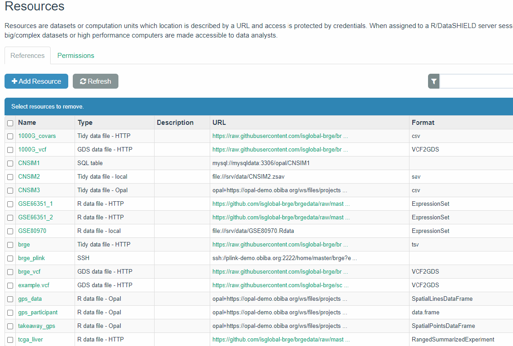

```{r setup_param, include=FALSE, purl=FALSE}
library(knitr)
BiocStyle::markdown()
options(width=100)
knitr::opts_chunk$set(comment="", warning=FALSE, message=FALSE, cache=TRUE)
```

# Introduction 

This tutorial aims to provide examples about how to analyze omics data in DataSHIELD. More detailed information can be found in our bookdown [Orchestrating privacy-protected non-disclosive big data analyses of data from different resources with R and DataSHIELD](https://isglobal-brge.github.io/resource_bookdown/).


# Getting started

This document can be reproduced by installing the following packages

```
install.packages("DSOpal")
devtools::install_github("datashield/dsBaseClient")
devtools::install_github("isglobal-brge/dsOmicsClient") 
```

Then the packages are loaded as usual

```{r load_packages}
library(DSOpal) 
library(dsBaseClient)
library(dsOmicsClient)
```


We have set up an [Opal demo site](http://opal-demo.obiba.org/) to illustrate how to perform different omic data analyses using DataSHIELD. The DataSHIELD user credentials are

- username: `dsuser`
- password: `password`

We also illustrate how to deal with different *resources* for 'omic data. For this, the Opal server can be accessed with the credentials:

- username: `administrator`
- password: `password`


This tutorial will mainly make use of the resources available at `RSRC` project

```{r resources, echo=FALSE, fig.cap='Resources available at Opal demo site of RSRC project',  fig.align='center', purl=FALSE}

```


and we will cover how to perform:

>
1. Transcriptomic data analysis
2. Epigenomic data analysis
3. GWAS
>

For those who are not familiar with omic data analysis or do not know the state-of-the-art methods, you can read this bookdown on [Omic Data Analysis with R/Bioconductor](https://isglobal-brge.github.io/Master_Bioinformatics/).


# Types of omic data analyses implemented

The Figure \@ref(fig:opalOmic) describes the different types of 'omic association analyses that can be performed using DataSHIELD client functions implemented in the `r BiocStyle::Githubpkg("isglobal-brge/dsOmicsClient")` package. Basically, data ('omic and phenotypes/covariates) can be stored in different sites (http, ssh, AWS S3, local, ...) and are managed with Opal through the `r BiocStyle::Githubpkg("obiba/resourcer")` package and their extensions implemented in `r BiocStyle::Githubpkg("isglobal-brge/dsOmics")`.  


```{r opalOmic, echo=FALSE, fig.cap="Non-disclosive omic data analysis with DataSHIELD and Bioconductor. The figure illustrates how the `resourcer` package is used to get access to omic data through the Opal servers. Then DataSHIELD is used in the client side to perform non-disclosive data analyses.", fig.align='center'}

```


The `dsOmicsClient` package allows different types of analyses: pooled and meta-analysis. Both methods are based on fitting different Generalized Linear Models (GLMs) for each feature when assessing association between 'omic data and the phenotype/trait/condition of interest. Of course, non-disclosive 'omic data analysis from a single study can also be performed.

The **pooled approach** (Figure \@ref(fig:omicAnal1)) is recommended when the user wants to analyze 'omic data from different sources and obtain results as if the data were located in a single computer. It should be noted that this can be very time consuming when analyzing multiple features since it calls a base function in DataSHIELD (`ds.glm`) repeatedly. It also cannot be recommended when data are not properly harmonized (e.g. gene expression normalized using different methods, GWAS data having different platforms, ...). Furthermore when it is necesary to remove unwanted variability (for transcriptomic and epigenomica analysis) or control for population stratification (for GWAS analysis), this approach cannot be used since we need to develop methods to compute surrogate variables (to remove unwanted variability) or PCAs (to to address population stratification) in a non-disclosive way. 


The **meta-analysis approach** Figure \@ref(fig:omicAnal2) overcomes the limitations raised when performing pooled analyses. First, the computation issue is addressed by using scalable and fast methods to perform data analysis at whole-genome level at each location The transcriptomic and epigenomic data analyses make use of the widely used `r BiocStyle::Biocpkg("limma")` package that uses `ExpressionSet` or `RangedSummarizedExperiment` Bioc infrastructures to deal with 'omic and phenotypic (e.g covariates). The genomic data are analyzed using `r BiocStyle::Biocpkg("GWASTools")` and `r BiocStyle::Biocpkg("GENESIS")` that are designed to perform quality control (QC) and GWAS using GDS infrastructure.


Next, we describe how both approaches are implemented: 

- **Pooled approach:** Figure \@ref(fig:omicAnal1) illustrate how this analysis is performed. This corresponds to generalized linear models (glm) on data from single or multiple sources. It makes use of `ds.glm()` function which is a DataSHIELD function that uses an approach that is mathematically equivalent to placing all individual-level data froma all sources in one central warehouse and analysing those data using the conventional `glm()` function in R. The user can select one (or multiple) features (i.e., genes, transcripts, CpGs, SNPs, ...) 


```{r omicAnal1, echo=FALSE, fig.cap="Non-disclosive omic data analysis with DataSHIELD and Bioconductor. The figure illustrates how to perform single pooled omic data analysis. The analyses are performed by using a generalized linear model (glm) on data from one or multiple sources. It makes use of `ds.glm()`, a DataSHIELD function, that uses an approach that is mathematically equivalent to placing all individual-level data from all sources in one central warehouse and analysing those data using the conventional `glm()` function in R.", fig.align='center'}
knitr::include_graphics("fig/dsOmics_B.jpg")
```


- **Meta-analysis:** Figure \@ref(fig:omicAnal2) illustrate how this analysis is performed. This corresponds to performing a genome-wide analysis at each location using functions that are specifically design for that purpose and that are scalable. Then the results from each location can be meta-analyzed using methods that meta-analyze either effect sizes or p-values.


```{r omicAnal2, echo=FALSE, fig.cap="Non-disclosive omic data analysis with DataSHIELD and Bioconductor. The figure illustrates how to perform anlyses at genome-wide level from one or multiple sources. It runs standard Bioconductor functions at each server independently to speed up the analyses and in the case of having multiple sources, results can be meta-analyzed uning standar R functions.", fig.align='center'}
knitr::include_graphics("fig/dsOmics_C.jpg")
```


## Differential gene expression (DGE) analysis


```{r include = FALSE}
download.file("https://github.com/isglobal-brge/dsOmicsClient/raw/master/vignettes/rmd/single_study_analysis_example.Rmd", "rmd_omic/single_study_analysis_example.Rmd")
```

```{r child='/rmd_omic/single_study_analysis_example.Rmd', include=TRUE}
```


## Epigenome-wide association analysis (EWAS) 

```{r include = FALSE}
download.file("https://github.com/isglobal-brge/dsOmicsClient/raw/master/vignettes/rmd/multiple_study_analysis_example.Rmd", "rmd_omic/multiple_study_analysis_example.Rmd")
```

```{r child='/rmd_omic/multiple_study_analysis_example.Rmd', include=TRUE}
```


### Single CpG analysis


```{r include = FALSE}
download.file("https://github.com/isglobal-brge/dsOmicsClient/raw/master/vignettes/rmd/single_cpg_analysis.Rmd", "rmd_omic/single_cpg_analysis.Rmd")
```

```{r child='/rmd_omic/single_cpg_analysis.Rmd', include=TRUE}
```

### Multiple CpG analysis

```{r include = FALSE}
download.file("https://github.com/isglobal-brge/dsOmicsClient/raw/master/vignettes/rmd/multiple_cpg_analysis.Rmd", "rmd_omic/multiple_cpg_analysis.Rmd")
```

```{r child='/rmd_omic/multiple_cpg_analysis.Rmd', include=TRUE}
```


### Adjusting for Surrogate Variables

```{r include = FALSE}
download.file("https://github.com/isglobal-brge/dsOmicsClient/raw/master/vignettes/rmd/surrogate_variables.Rmd", "rmd_omic/surrogate_variables.Rmd")
```

```{r child='/rmd_omic/surrogate_variables.Rmd', include=TRUE}
```


## Genome-wide association analyses (GWAS)

Genomic data can be stored in different formats. [VCF](https://www.internationalgenome.org/wiki/Analysis/vcf4.0/) and [PLINK](http://zzz.bwh.harvard.edu/plink/) files are commonly used in genetic epidemiology studies. We have a GWAS example available at [BRGE data repository](https://github.com/isglobal-brge/brgedata) that aims to find SNPs associated with asthma. We have data stored in VCF (brge.vcf) with several covariates and phenotypes available in the file brge.txt (gender, age, obesity, smoking, country and asthma status). The same data is also available in PLINK format (brge.bed, brge.bim, brge.fam) with covariates in the file brge.phe.

Here we illustrate how to perform GWAS using R and Bioconductor packages or PLINK shell command line. 


### GWAS with Bioconductor {#gwasBioc}

```{r include = FALSE}
download.file("https://github.com/isglobal-brge/dsOmicsClient/raw/master/vignettes/rmd/gwas_BioC.Rmd", "rmd_omic/gwas_BioC.Rmd")
```

```{r child='/rmd_omic/gwas_BioC.Rmd', include=TRUE}
```


### GWAS with PLINK

```{r include = FALSE}
download.file("https://github.com/isglobal-brge/dsOmicsClient/raw/master/vignettes/rmd/plink.Rmd", "rmd_omic/plink.Rmd")
```

```{r child='/rmd_omic/plink.Rmd', include=TRUE}
```


# Real application: Epigenomic changes and green spaces

```{r setup_cache, include=FALSE, purl=FALSE}
knitr::opts_chunk$set(cache.path = 'dsOmics_greenspace_cache/')
```

Our main aim is to train ATHLETE researchers to perform omic data analysis linking the epigenome with the exposome. WP3 and WP4 have setup a project (`GREENSPACE`) that will be used as proof-of-concept of our developed infrastructure. This figure summarized that project

```{r greenspace, echo=FALSE, fig.cap='GREENSPACE project overview. Linking the exposome (green space) with the epigenome', fig.align='center', out.width='110%', purl=FALSE}

```


We prepared some datasets with this information:

```{r samplesizeGS, echo=FALSE, fig.cap='GREENSPACE project available data', fig.align='center', out.width='80%', purl=FALSE}

```


The variables we have are:

- **CODE**: id number that links to the sample names in the `ExposomeSet`
- **Green access** (greenyn300_0): Is there a green space of >5,000 m2 in a distance of 300 m, at birth? [binary, 0=no; 1=yes]
- **Green access** (greenyn300_s): Is there a green space of >5,000 m2 in a distance of 300 m, at school? [binary, 0=no; 1=yes]
- **Green access** (greenyn300_4): Is there a green space of >5,000 m2 in a distance of 300 m, at 4y? [binary, 0=no; 1=yes]
- **Greeness** (ndvi100_0): Average of normalized difference vegetation index (NDVI) within a buffer of 100 m, at birth [continuous, in ndvi value]
- **Greeness** (ndvi100_s): Average of normalized difference vegetation index (NDVI) within a buffer of 100 m, at school [continuous, in ndvi value]
- **Greeness** (ndvi100_4): Average of normalized difference vegetation index (NDVI) within a buffer of 100 m, at 4y [continuous, in ndvi value]


So, the requirements to perform such analyses are:

1. To install `dsBaseClient` and `dsOmicsClient` R packages into analyst computer.
2. To have harmonized exposome data in a opal server for each cohort (already done in LifeCycle) (**Tables**).
3. To have a resource with an `ExpressioSet` encapsulating methylation data for each cohort (**Resources**) [see [here](https://rpubs.com/jrgonzalezISGlobal/tutorial_resources) for a description of an `ExpressionSet` and how to deal with it as a resource] 
     - WP4 is providing an R code to create such `ExpressionSet`
     - Each cohort will provide the URL having an `.Rdata` file with the required object. 
4. [To install required DataSHIELD packages into the Opal server](https://isglobal-brge.github.io/resource_bookdown/tips-and-tricks.html#how-to-install-datashield-packages-into-opal-server): `dsOmics`, `dsBase` and `resourcer`

For this tutorial, we have tried to mimic real situations we have a project called `GREENSPACE` in our Opal demo server having exposome data for 3 cohorts (simulated data). 


```{r tablesGS, echo=FALSE, fig.cap='Tables available in the project GREENSPACE of Opal demo site', fig.align='center', purl=FALSE}

```

In the next figure we can see that there are 7 variables at each table and different number of samples (117, 178, 160). Using what you have learn in the DataSHIELD beginners course, you can obtain this information from the client site.

We start by creating the connection to our server and assigning the tables to an R object called `exposome`:

```{r check}
library(DSOpal)
library(dsBaseClient)


builder <- newDSLoginBuilder()
builder$append(server = 'study1', url = 'https://opal-demo.obiba.org', 
               user = 'dsuser', password = 'password')
builder$append(server = 'study2', url = 'https://opal-demo.obiba.org', 
               user = 'dsuser', password = 'password')
builder$append(server = 'study3', url = 'https://opal-demo.obiba.org', 
               user = 'dsuser', password = 'password')


logindata <- builder$build()
conns <- datashield.login(logins = logindata)

datashield.assign.table(conns, symbol = "exposome",
                        table = list(study1 = "GREENSPACE.Cohort1_exposome",
                                     study2 = "GREENSPACE.Cohort2_exposome",
                                     study3 = "GREENSPACE.Cohort3_exposome"))
```

The we can run basic DataSHIELD commands

```{r}
ds.class('exposome')
ds.dim('exposome')
ds.colnames('exposome')
```

The three `.Rdata` file containing the different `ExpressionSet`s are available at:

- https://github.com/isglobal-brge/brgedata/blob/master/data/Cohort1_Methyl_C_blood_0y_450K.Rdata?raw=true
- https://github.com/isglobal-brge/brgedata/blob/master/data/Cohort2_Methyl_C_blood_0y_450K.Rdata?raw=true
- https://github.com/isglobal-brge/brgedata/blob/master/data/Cohort3_Methyl_C_blood_0y_450K.Rdata?raw=true

So, we need to create the resources into the Opal server as we leant in the section 3.3 of the [resources workshop](https://rpubs.com/jrgonzalezISGlobal/tutorial_resources). Our GREENSPACE project already have those resources created:

```{r resourcesGS, echo=FALSE, fig.cap='Resources available in the project GREENSPACE of Opal demo site', fig.align='center', purl=FALSE}

```

Then, we can load those resources into our DataSHIELD session as an R object called `methy` which is an object of class `ExpressionSet` by:

```{r add_resources}
datashield.assign.resource(conns, symbol = "eSet",
                           resource = list(study1 = "GREENSPACE.Cohort1_Methyl_C_blood_0y_450K",
                                           study2 = "GREENSPACE.Cohort2_Methyl_C_blood_0y_450K",
                                           study3 = "GREENSPACE.Cohort3_Methyl_C_blood_0y_450K"))

datashield.assign.expr(conns, symbol = "methy", expr = quote(as.resource.object(eSet)))
```

Then, using `dsOmicsClient` library we can first check that our methylation data have properly been integrated into the DataSHIELD R server


```{r check_resources}
library(dsOmicsClient)
ds.class('methy')
ds.nFeatures('methy')
ds.nSamples('methy')
```

Then, in order to be able to use `ds.limma ()` we need first to add the exposome data to the `ExpressionSet` object. To this end, the function `ds.addPhenoData ()` has been created

```{r addtable}
ds.addPhenoData('methy', 'exposome', identifier = "CODE", name = 'methy2')
```

This function creates a new object in the R server side that is called `methy2`

```{r ls}
ds.ls()
```

This is an object of class `ExpressionSet`

```{r}
ds.class('methy2')
```

Having the exposures in the phenotypic data

```{r showvars}
ds.fvarLabels('methy')
ds.fvarLabels('methy2')
```

we can verify that matching has properly been performed

```{r}
ds.nSamples('methy2')
```

Now, we are ready to perform the required EXWAS by

```{r exwas}
ewas <- ds.limma(model = ~ h_greenyn300_preg_None,
                      Set = "methy2")
```


We can meta-analyze our results as we want, since we have the required information in our computer

```{r show_exwas}
ewas
```

We have implemented a very simple function that makes use of [metap](https://cran.r-project.org/web/packages/metap/vignettes/compare.pdf) package to combine p-values from microarray experiments. For both ATHELETE and LifeCycle researchers we highly recommend to use our [EASIER](https://github.com/isglobal-brge/EASIER/blob/main/vignettes/EASIER.pdf) package

```{r meta}
metaPvalues(ewas)
```


We can also run analyses adjusted for cell types if metadata is available in the `ExpressionSet`


```{r}
ds.fvarLabels('methy2')
```


Do not forget to logout the connection


```{r logoutexwas}
datashield.logout(conns)    
```
  


# Session Info

```{r}
sessionInfo()
```